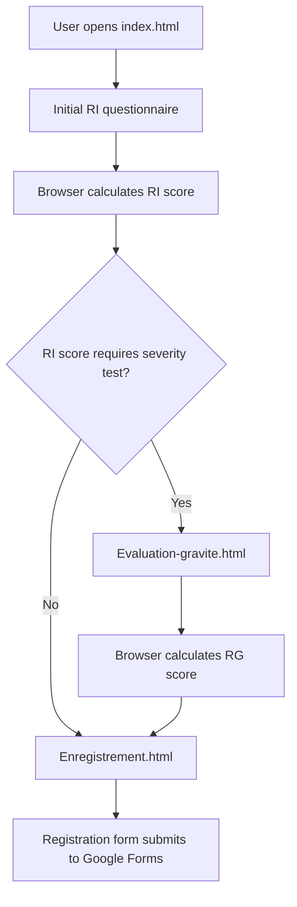

# HTML App Project

Static web application for COVID-19 risk evaluation and registration. The app presents a bilingual questionnaire, calculates risk scores in the browser, and provides a registration form that submits responses to Google Forms.

## Project Overview

This project is a front-end only application built with HTML, CSS, and JavaScript. It can be opened directly in a browser or served from a containerized Apache HTTP Server image.

The application includes:

- Initial COVID-19 symptom and exposure risk evaluation
- Secondary severity risk evaluation
- Registration form for collecting user details and calculated scores
- Static assets for styling and page backgrounds
- Dockerfile for running the app with Apache `httpd`

## Repository Structure

```text
.
├── Dockerfile
├── index.html
├── Evaluation-gravite.html
├── Enregistrement.html
├── question.js
├── question2.js
├── quiz-script.js
├── quiz-script2.js
├── scripts.js
├── quiz.css
├── quiz2.css
├── styles.css
├── back.jpg
└── tatiana.jpg
```

## How The App Works

1. `index.html` loads the first COVID-19 risk questionnaire.
2. `question.js` stores the initial risk questions.
3. `quiz-script.js` calculates the initial RI score.
4. If the RI score is high enough, the app links to `Evaluation-gravite.html`.
5. `Evaluation-gravite.html`, `question2.js`, and `quiz-script2.js` calculate the RG severity score.
6. `Enregistrement.html` collects registration details and submits the data to a configured Google Forms endpoint.

## Run Locally

Because this is a static app, you can open `index.html` directly in a browser.

For a local HTTP server, run:

```bash
python3 -m http.server 8080
```

Then open:

```text
http://localhost:8080
```

## Run With Docker

Build the image:

```bash
docker build -t html-app-project .
```

Run the container:

```bash
docker run --rm -p 8080:80 html-app-project
```

Open the app:

```text
http://localhost:8080
```

## Dockerfile Summary

The Dockerfile uses the official Apache HTTP Server image:

```dockerfile
FROM httpd:2.4
```

It copies the static project files into Apache's default web root:

```dockerfile
COPY . .
```

Apache serves the application on port `80` inside the container.

## Data Flow



## Operational Notes

- This is a static browser application. There is no backend server-side validation in this repository.
- The registration form submits to an external Google Forms endpoint.
- Any production deployment should verify the form destination, data retention policy, privacy requirements, and user consent flow.
- The app contains health-related content, so it should be reviewed by qualified medical and compliance stakeholders before public use.

## Basic Validation Checklist

Before publishing changes:

- Confirm `index.html` loads successfully.
- Complete the initial questionnaire and verify the RI score displays.
- For high RI scores, confirm the second test link appears.
- Complete the second questionnaire and verify the RG score displays.
- Confirm the registration page loads and required fields are enforced.
- Build and run the Docker image successfully.

## Maintenance Notes

- Keep question content in `question.js` and `question2.js`.
- Keep score calculation logic in `quiz-script.js` and `quiz-script2.js`.
- Keep form validation logic in `scripts.js`.
- Keep visual styling in `quiz.css`, `quiz2.css`, and `styles.css`.
- Review the Google Forms endpoint before deploying to any shared or public environment.
